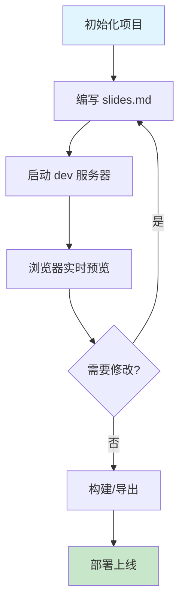
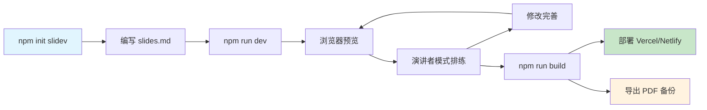

# Slidev 详细学习方案

<div class="text-lg opacity-80 mt-2">
  基于 Markdown 的下一代演示文稿工具
</div>

<div class="pt-6 text-sm opacity-60">
  个人学习练习
</div>

<div @click="$slidev.nav.next" class="mt-10 py-1" hover:bg="white op-10">
  按空格键开始 <carbon:arrow-right />
</div>

---
transition: fade-out
---

# 展示提纲

<div class="grid grid-cols-2 gap-8 mt-8">
<div class="border rounded-lg p-6 bg-blue-50 bg-opacity-10">

### 上篇 · 学习方案
- Slidev 是什么？为什么选它？
- 环境搭建与项目初始化
- 核心语法与功能详解
- 主题、布局与组件系统

</div>
<div class="border rounded-lg p-6 bg-red-50 bg-opacity-10">

### 下篇 · 工作流总结
- 实际开发工作流
- 进阶技巧与最佳实践
- 部署与导出方案
- 学习总结与踩坑记录

</div>
</div>

<v-click>

<div class="mt-6 text-center opacity-70">

💡 学习主线：**从零到一，掌握 Slidev 全流程**

</div>

</v-click>

---
layout: center
class: text-center
---

# 上篇：学习方案

<div class="text-xl opacity-60 mt-4">
  Slidev 是什么？怎么用？
</div>

---

# 一、Slidev 简介

<div class="grid grid-cols-2 gap-8 mt-4">
<div>

## 什么是 Slidev？

Slidev 是一个为开发者设计的**基于 Markdown 的演示文稿工具**。

<v-clicks>

- 📝 用 Markdown 写内容，专注文字
- 🎨 支持主题切换，一键换肤
- 🧑‍💻 代码高亮、实时编码
- 🤹 内嵌 Vue 组件，交互性强
- 📤 导出 PDF / PPTX / PNG
- 🔄 热更新，改完即看

</v-clicks>

</div>
<div>

## 为什么选 Slidev？

<v-clicks>

- ✅ **高效**：纯文本编写，版本控制友好
- ✅ **美观**：内置主题，开箱即用
- ✅ **灵活**：支持 Vue 组件和 UnoCSS
- ✅ **开发者友好**：代码高亮、Monaco 编辑器
- ✅ **免费开源**：社区活跃，生态丰富
- ✅ **跨平台**：浏览器直接运行

</v-clicks>

</div>
</div>

---
layout: image-right
image: https://cover.sli.dev
---

# 与传统工具对比

<div class="text-sm mt-4">

| 特性 | PowerPoint | Google Slides | Slidev |
|------|-----------|---------------|--------|
| 编写方式 | GUI 拖拽 | GUI 拖拽 | Markdown |
| 版本控制 | 差 | 一般 | Git 友好 |
| 代码高亮 | 需插件 | 需插件 | 原生支持 |
| 主题切换 | 手动换模板 | 手动换模板 | 一行配置 |
| 动画效果 | 丰富 | 一般 | Vue 驱动 |
| 导出格式 | PPTX | PDF | PDF/PPTX/PNG |
| 学习成本 | 低 | 低 | 中（需会 Markdown） |
| 适合人群 | 通用 | 通用 | 开发者/技术分享 |

</div>

---
layout: center
---

# 🤔 互动讨论

<div class="text-xl mt-8 mb-4">
  你平时用什么工具做 PPT？有什么痛点？
</div>

<v-click>

<div class="text-lg opacity-70">

常见痛点：
- 排版对齐困难，浪费时间
- 代码展示效果差
- 多人协作版本混乱
- 换模板要重新排版

</div>

</v-click>

---
layout: center
class: text-center
---

# 二、环境搭建

---
level: 2
---

# 环境准备

<div class="grid grid-cols-2 gap-8 mt-4">
<div>

## 前置条件

- **Node.js** >= 18.18（推荐 20+）
- **npm** 或 **pnpm**（包管理器）
- **VS Code**（推荐编辑器）

```bash
# 检查版本
node -v
npm -v
```

</div>
<div>

## 创建项目

```bash
# 方式一：交互式创建（推荐）
npm init slidev@latest

# 方式二：直接安装
npm i @slidev/cli @slidev/theme-default
```

<v-click>

<div class="mt-4 p-3 bg-yellow-50 bg-opacity-10 rounded-lg text-sm">

⚠️ 不需要全局安装！项目级安装更灵活，版本更好管理

</div>

</v-click>

</div>
</div>

---
level: 2
---

# 项目结构

<div class="text-sm mt-2">

```
slidev-project/
├── slides.md          # 📄 主要幻灯片内容（核心文件）
├── package.json       # 📦 项目配置和依赖
├── components/        # 🧩 自定义 Vue 组件
│   └── Counter.vue
├── pages/             # 📑 额外的幻灯片页面
│   └── imported-slides.md
├── public/            # 🖼️ 静态资源（图片等）
├── snippets/          # 💻 代码片段
│   └── external.ts
└── styles/            # 🎨 自定义样式
    └── index.css
```

</div>

<v-click>

<div class="mt-4 p-3 bg-blue-50 bg-opacity-10 rounded-lg">

💡 **核心文件是 `slides.md`**，所有幻灯片内容都在这里编写。其他文件夹按需使用。

</div>

</v-click>

---
level: 2
---

# 启动与常用命令

<div class="grid grid-cols-2 gap-8 mt-4">
<div>

## 常用命令

```bash
# 启动开发服务器
npm run dev
# 或
npx slidev --remote

# 构建静态站点
npm run build

# 导出为 PDF
npm run export

# 格式化 Markdown
npx slidev format
```

</div>
<div>

## 开发服务器地址

| 地址 | 用途 |
|------|------|
| `localhost:3030` | 演示模式 |
| `localhost:3030/presenter/` | 演讲者模式 |
| `localhost:3030/overview/` | 幻灯片总览 |
| `localhost:3030/export/` | 导出预览 |

<v-click>

<div class="mt-4 p-3 bg-green-50 bg-opacity-10 rounded-lg text-sm">

💡 Windows 上如果浏览器打不开，加 `--remote` 参数启动

</div>

</v-click>

</div>
</div>

---
layout: center
class: text-center
---

# 三、核心语法

---
level: 2
---

# 基本语法：幻灯片分隔

<div class="mt-4">

用三个短横线 `---` 分隔每一页幻灯片：

</div>

````md
---
# 第一页标题
这是第一页的内容

---
# 第二页标题
这是第二页的内容

---
# 第三页标题
这是第三页的内容
````

<v-click>

<div class="mt-4 p-3 bg-blue-50 bg-opacity-10 rounded-lg">

💡 第一个 `---` 之前的内容是**全局配置**（frontmatter），之后每两个 `---` 之间是一页幻灯片

</div>

</v-click>

---
level: 2
---

# Frontmatter 配置

<div class="grid grid-cols-2 gap-6 mt-4">
<div>

## 全局配置（文件顶部）

```yaml
---
theme: seriph           # 主题
background: https://...  # 背景图
title: 演示文稿标题      # 标题
transition: slide-left   # 切换动画
duration: 45min          # 演示时长
---
```

</div>
<div>

## 单页配置（页面开头）

```yaml
---
layout: two-cols      # 布局
layoutClass: gap-16   # 布局样式
level: 2              # 标题层级
transition: fade-out  # 本页切换动画
class: text-center    # CSS 类
---
```

</div>
</div>

<v-click>

<div class="mt-4">

## 常用布局

`default` · `center` · `two-cols` · `image-right` · `image-left` · `image` · `quote` · `section` · `cover` · `end`

</div>

</v-click>

---
level: 2
---

# Markdown 扩展语法

<div class="grid grid-cols-2 gap-6 mt-4">
<div>

## 代码高亮

````md
```ts {2,3}
const a = 1
const b = 2
const c = 3
```
````

<v-click>

<div class="text-sm mt-2">

- `{2,3}` 高亮第 2、3 行
- `{all|2|3}` 点击逐步高亮
- `{monaco}` 变成可编辑编辑器
- `{monaco-run}` 可执行代码块

</div>

</v-click>

</div>
<div>

## LaTeX 公式

```md
行内公式：$E = mc^2$

块级公式：
$$
\sum_{i=1}^{n} x_i
$$
```

<v-click>

## Mermaid 图表

````md

````

</v-click>

</div>
</div>

---
level: 2
---

# 点击动画

<div class="grid grid-cols-2 gap-6 mt-4">
<div>

## v-click 指令

```html
<div v-click>
  点击后显示
</div>
```

```html
<v-clicks>
  <li>第一项</li>
  <li>第二项</li>
  <li>第三项</li>
</v-clicks>
```

<v-click>

<div class="text-sm mt-2">

`v-click` 单个元素逐个显示
`v-clicks` 列表项逐个显示

</div>

</v-click>

</div>
<div>

## 高级用法

```html
<!-- 指定显示顺序 -->
<div v-click="[2, 4]">
  第 2-4 次点击时显示
</div>

<!-- 标记高亮 -->
<span v-mark.red>
  红色标记
</span>

<!-- 箭头指向 -->
<arrow v-click
  x1="100" y1="100"
  x2="200" y2="200"
  color="#953" />
```

</div>
</div>

---
layout: center
class: text-center
---

# 四、主题与组件

---
level: 2
---

# 主题系统

<div class="grid grid-cols-2 gap-6 mt-4">
<div>

## 内置主题

- **default** — 简洁默认主题
- **seriph** — 衬线字体，优雅大方
- **apple-basic** — 苹果风格
- **dracula** — 暗色主题
- **shades-of-purple** — 紫色调

## 切换主题

只需修改 frontmatter：

```yaml
---
theme: dracula
---
```

</div>
<div>

## 安装第三方主题

```bash
npm i slidev-theme-主题名
```

然后在 frontmatter 中引用：

```yaml
---
theme: 主题名
---
```

<v-click>

<div class="mt-4 p-3 bg-purple-50 bg-opacity-10 rounded-lg text-sm">

🎨 主题库：[sli.dev/resources/theme-gallery](https://sli.dev/resources/theme-gallery)

</div>

</v-click>

</div>
</div>

---
level: 2
---

# Vue 组件系统

<div class="grid grid-cols-2 gap-6 mt-4">
<div>

## 内置组件

```html
<!-- 目录生成 -->
<Toc minDepth="1" maxDepth="2" />

<!-- 计数器 -->
<Counter :count="10" />

<!-- 点击列表 -->
<v-clicks>
  <li>项目一</li>
  <li>项目二</li>
</v-clicks>
```

</div>
<div>

## 自定义组件

在 `components/` 目录创建 `.vue` 文件：

```vue
<!-- components/MyBadge.vue -->
<template>
  <span class="badge">
    <slot />
  </span>
</template>
```

然后直接在 Markdown 中使用：

```html
<MyBadge>标签文字</MyBadge>
```

</div>
</div>

<v-click>

<div class="mt-4 p-3 bg-blue-50 bg-opacity-10 rounded-lg">

💡 组件自动注册，无需 import，放在 `components/` 目录即可

</div>

</v-click>

---
layout: center
class: text-center
---

# 下篇：工作流总结

<div class="text-xl opacity-60 mt-4">
  从开发到部署的完整流程
</div>

---

# 五、开发工作流

<div class="flex justify-center mt-4">



</div>

<v-click>

<div class="grid grid-cols-3 gap-4 mt-6 text-sm">
<div class="border rounded p-3 text-center">

**编写阶段**
Markdown 编写内容
Frontmatter 配置页面
Vue 组件增强交互

</div>
<div class="border rounded p-3 text-center">

**预览阶段**
热更新实时反馈
演讲者模式排练
幻灯片总览检查

</div>
<div class="border rounded p-3 text-center">

**发布阶段**
构建静态站点
导出 PDF/PPTX
部署到 Vercel/Netlify

</div>
</div>

</v-click>

---
level: 2
---

# 演讲者模式

<div class="grid grid-cols-2 gap-6 mt-4">
<div>

## 功能

- 🖥️ 当前幻灯片 + 下一张预览
- 📝 演讲者备注（在 `<!-- -->` 中写）
- ⏱️ 计时器
- 📋 幻灯片导航

## 使用

访问 `/presenter/` 路径：

```
http://localhost:3030/presenter/
```

</div>
<div>

## 写备注

在幻灯片末尾写 HTML 注释：

```md
---
# 这页的内容

<!--
这是演讲者备注
观众看不到，但演讲者模式下可见
支持 **Markdown** 格式
-->
---
```

<v-click>

<div class="mt-4 p-3 bg-green-50 bg-opacity-10 rounded-lg text-sm">

💡 演讲者模式是答辩/展示的利器

</div>

</v-click>

</div>
</div>

---
level: 2
---

# 导出与部署

<div class="grid grid-cols-2 gap-6 mt-4">
<div>

## 导出格式

```bash
# 导出 PDF
npx slidev export

# 导出 PPTX
npx slidev export --format pptx

# 导出 PNG（每页一张图）
npx slidev export --format png
```

<v-click>

<div class="mt-3 p-3 bg-yellow-50 bg-opacity-10 rounded-lg text-sm">

⚠️ 导出 PDF/PPTX 需要安装 Playwright：

```bash
npx playwright install chromium
```

</div>

</v-click>

</div>
<div>

## 部署方案

| 平台 | 命令 | 说明 |
|------|------|------|
| Vercel | `vercel deploy` | 零配置部署 |
| Netlify | 拖拽 `dist/` 目录 | 静态托管 |
| GitHub Pages | CI/CD 自动化 | 免费托管 |
| 本地预览 | `npx slidev` | 直接运行 |

```bash
# 构建静态站点
npm run build

# 输出在 dist/ 目录
```

</div>
</div>

---

# 六、进阶技巧

<div class="grid grid-cols-2 gap-6 mt-4">
<div>

## 代码逐步高亮

````md
```ts {all|1|2-3|all}
const a = 1    // 第一次点击高亮
const b = 2    // 第二次点击高亮 2-3 行
const c = 3
```
````

## 图片布局

```md
---
layout: image-right
image: /path/to/image.png
---
左侧写文字，右侧显示图片
```

</div>
<div>

## 多栏布局

```md
---
layout: two-cols
layoutClass: gap-16
---
左侧内容

::right::

右侧内容
```

## 导入子页面

```md
---
src: ./pages/chapter2.md
---
```

</div>
</div>

<v-click>

<div class="mt-4 p-3 bg-purple-50 bg-opacity-10 rounded-lg">

💡 Slidev 支持几乎所有 Web 技术：CSS 动画、Vue 指令、UnoCSS 工具类...

</div>

</v-click>

---

# 七、最佳实践

<div class="grid grid-cols-2 gap-6 mt-4">
<div>

## ✅ 推荐做法

<v-clicks>

- 用 Git 管理 `slides.md`，方便版本回溯
- 每页内容精简，避免信息过载
- 善用 `v-click` 控制信息节奏
- 代码块用高亮行号引导注意力
- 用演讲者模式提前排练
- 导出 PDF 作为备份方案

</v-clicks>

</div>
<div>

## ❌ 避免事项

<v-clicks>

- 一页放太多文字，像在读文档
- 滥用动画，分散观众注意力
- 忘记测试导出效果
- 不写备注，临场发挥
- 忽略移动端显示效果
- 直接在 `slides.md` 里写复杂逻辑

</v-clicks>

</div>
</div>

---
layout: center
---

# 📝 踩坑记录

<div class="grid grid-cols-2 gap-6 mt-6 text-sm">
<div class="border-l-4 border-red-400 pl-4">

### 问题一：浏览器打不开

**原因**：Windows 上 Slidev 默认绑定 IPv6，浏览器连不上

**解决**：启动时加 `--remote` 参数

```bash
npx slidev --remote
```

</div>
<div class="border-l-4 border-orange-400 pl-4">

### 问题二：导出 PDF 失败

**原因**：缺少 Playwright 的 Chromium

**解决**：

```bash
npx playwright install chromium
```

</div>
</div>

<v-click>

<div class="grid grid-cols-2 gap-6 mt-4 text-sm">
<div class="border-l-4 border-blue-400 pl-4">

### 问题三：主题样式不生效

**原因**：UnoCSS 类名写错或未安装主题

**解决**：检查主题是否安装，类名是否正确

</div>
<div class="border-l-4 border-green-400 pl-4">

### 问题四：组件不显示

**原因**：组件文件放错目录或命名错误

**解决**：确保放在 `components/` 目录，文件名即组件名

</div>
</div>

</v-click>

---
level: 2
---

# 完整工作流总结

<div class="flex justify-center mt-2">



</div>

<v-click>

<div class="grid grid-cols-4 gap-3 mt-6 text-sm text-center">
<div class="border rounded p-2">

**Step 1**
创建项目
`npm init slidev`

</div>
<div class="border rounded p-2">

**Step 2**
编写内容
Markdown + Vue

</div>
<div class="border rounded p-2">

**Step 3**
预览排练
`npm run dev`

</div>
<div class="border rounded p-2">

**Step 4**
部署发布
build + deploy

</div>
</div>

</v-click>

---

# 八、学习资源

<div class="grid grid-cols-2 gap-8 mt-6">
<div>

## 官方资源

- 📖 官方文档：[sli.dev](https://sli.dev)
- 💻 GitHub：[github.com/slidevjs/slidev](https://github.com/slidevjs/slidev)
- 🎨 主题库：[sli.dev/resources/theme-gallery](https://sli.dev/resources/theme-gallery)
- 📺 示例展示：[sli.dev/resources/showcases](https://sli.dev/resources/showcases)

</div>
<div>

## 推荐学习路径

<v-clicks>

1. **入门**：通读官方文档 Getting Started
2. **实践**：用默认主题写一个 10 页演示
3. **进阶**：学习组件、动画、布局系统
4. **高级**：自定义主题、开发 Vue 组件
5. **输出**：导出 PDF 并部署上线

</v-clicks>

</div>
</div>

<v-click>

<div class="mt-6 text-center">

> 🚀 Slidev 让演示文稿回归内容本身，用代码的方式做 PPT

</div>

</v-click>

---
layout: center
---

# 📌 学习总结

<div class="grid grid-cols-3 gap-4 mt-6 text-sm text-center">
<div class="border rounded p-3">

**核心收获**
Markdown 驱动演示
专注内容，高效排版

</div>
<div class="border rounded p-3">

**适用场景**
技术分享、课程作业
个人学习笔记展示

</div>
<div class="border rounded p-3">

**下一步计划**
深入学习组件开发
尝试自定义主题

</div>
</div>

---
layout: center
class: text-center
---

# 谢谢观看

<div class="mt-6 opacity-70">
  Slidev 学习方案与工作流总结 · 个人学习练习
</div>

<div class="mt-4 text-sm opacity-50">
  Slidev · 基于 Markdown 的演示文稿工具
</div>
